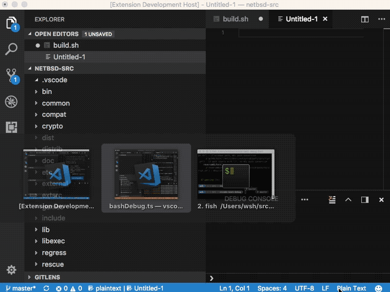

# Bash Debugger for Visual Studio Code
Attempt to create a bash debugger GUI frontend based on awesome bashdb scripts.

# Overview
The idea is to modify Mock Debug to create SIMPLE bash debugger frontend. Features should be limited, keeping in mind that bashdb itself is not a "real" debugger. Might be useful for simple scripts and hopefully bash will land on 3 leading platforms making this tool "numero uno" :).

# Want to help?

Microsoft's documentation for VS Code extensions is suprisingly good (https://code.visualstudio.com/docs/extensions/overview);

## On Linux:
1. install VS Code, npm, nodejs, bashdb (on Ubuntu nodejs-legacy was required) + build essentials
2. clone project
3. open VS Code, select project's folder, open terminal and type "npm install" (this will download dependencies)
4. Run by clicking Ctrl+F5, new VS window will open
5. Create some folder with one script file, then try debugging it by F5

## On Windows
All the pieces seems to be there, but for some reason bash support needs some kick off (https://github.com/Microsoft/BashOnWindows/issues/2#issuecomment-209118529). Lets see...

## On OS X
???
